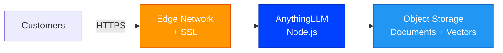
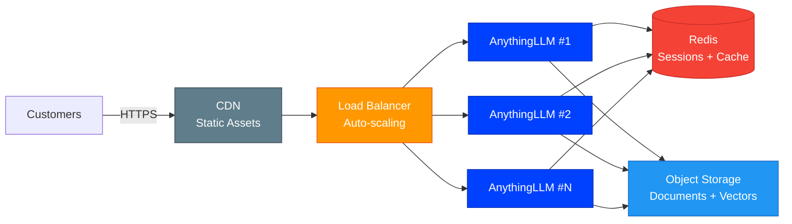

# AnythingLLM [](https://github.com/stackblaze-templates/anythingllm) [](https://stackblaze.com) [](https://github.com/stackblaze-templates/anythingllm/actions) [](LICENSE) [](https://stackblaze.com)

<p align="center"></p>

An all-in-one AI app for chatting with documents, using multiple LLM providers, and managing knowledge bases with RAG support.

> **Credits**: Built on [AnythingLLM](https://anythingllm.com) by [Mintplex Labs](https://github.com/Mintplex-Labs). All trademarks belong to their respective owners.

## Local Development

```bash
docker compose up
```

See the project files for configuration details.

## Deploy on StackBlaze

[](https://stackblaze.com)

This template includes a `stackblaze.yaml` for one-click deployment on [StackBlaze](https://stackblaze.com). Both options run on **Kubernetes** for reliability and scalability.

<details>
<summary><strong>Standard Deployment</strong> — Single-instance Kubernetes setup for startups and moderate traffic</summary>

<br/>



**What you get:**
- Single AnythingLLM instance on Kubernetes
- Automatic SSL/TLS via StackBlaze edge network
- Object storage for media and assets
- Automated daily backups
- Zero-downtime deploys

**Best for:** Development, staging, and moderate-traffic production environments.

</details>

<details>
<summary><strong>High Availability Deployment</strong> — Multi-instance Kubernetes setup for business-critical production</summary>

<br/>



**What you get:**
- Auto-scaling AnythingLLM pods on Kubernetes behind a load balancer
- Redis for shared sessions, cache, and queue management
- CDN for static assets
- Shared object storage across all instances
- Automated failover and self-healing
- Zero-downtime rolling deploys

**Best for:** Production workloads, high-traffic applications, business-critical deployments.

</details>

---

### Maintained by [StackBlaze](https://stackblaze.com)

This template is actively maintained by StackBlaze. We perform **weekly automated checks** to ensure:

- **Up-to-date dependencies** — frameworks, libraries, and base images are kept current
- **Security scanning** — continuous monitoring for known vulnerabilities and CVEs
- **Best practices** — configurations follow current recommendations from upstream projects

Found an issue? [Open a ticket](https://github.com/stackblaze-templates/anythingllm/issues).
